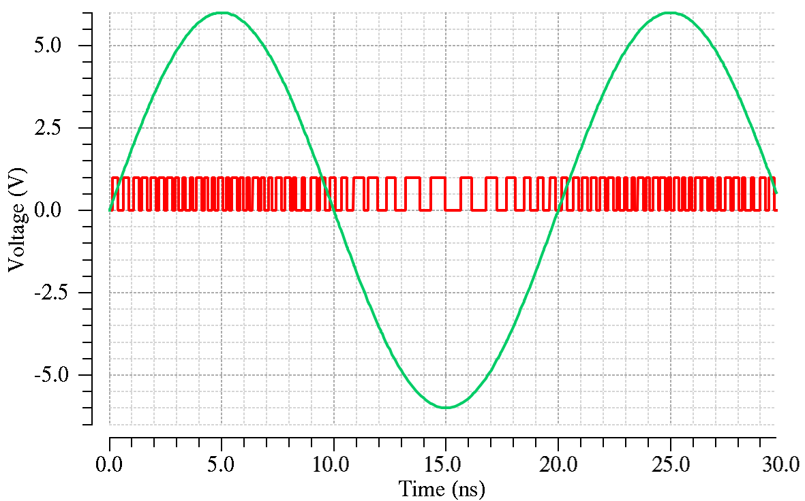
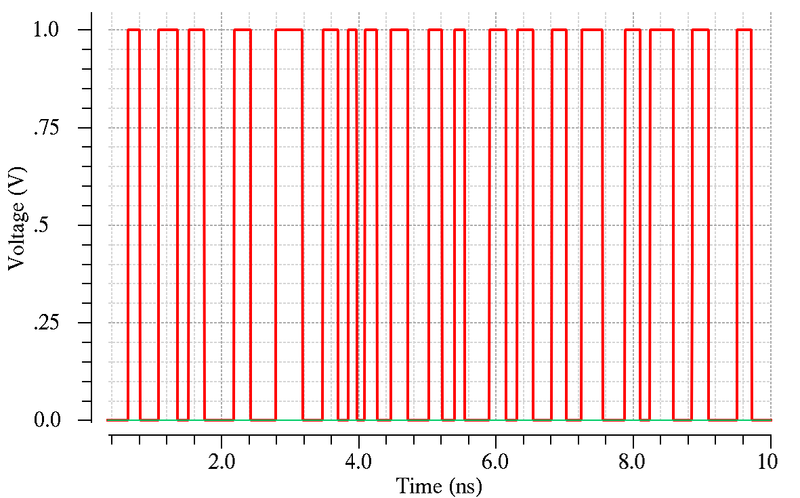
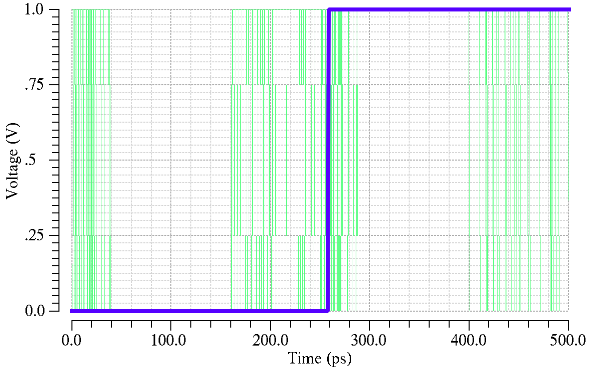

## <center> Verilog-A Modeling: Voltage Controlled Oscillator</center>

<center><b>Name</b>: Yujiang Guan）          <b>E-Mail</b>: guanyj@stu.pku.edu.cn </center>

### Part 1 - Analysis

> **Specification**: Create a Verilog-A model to generate a voltage controlled pulse. 
>
> 1. Duty cycle=50% .
>
> 2. Using `transition` to output the pulse wave  .
>
> 3. Using `idtmod` instead of `idt` to calculate the phase: from –pi to +pi  
>
> 4. Output is high if the phase is [-pi/2, pi/2], otherwise output is low.
>
> 5. $f_{out} = f_{0}+Kv_{in}$,  $f_{0}=2GHz(V_{in}=0) $ , $K=200MHz/V$
> 
>       
> 

The essential idea behind a VCO design is to generate a clock signal based on the Barkhausen criteria for oscillation which states that the magnitude of the VCO transfer function at the oscillation-frequency is 1 while the phase is -180 degrees  In this assignment, a LC-Tank base voltage controlled oscillator (VCO) is purposed to be modeled using Verilog-A. Ideally, its output frequency should be linearly related to the input control voltage, as shown in the above expression.
$$
\mathcal{L}[\phi_{out}(t)]=\phi_{out}(s)=w_{out}(s)/s=K_{VCO}v_{ctrl}(s)/s
$$
In order to module the VCO, several points should be considered and analyzed:

1. Firstly, the parameters of VCO are initialized at beginning. The characteristic frequency $f_c$ of the system is 2 GHz and the VCO gain $K_{VCO}$ is set as 200 MHz/V.
2. The phase of the system is calculated by the circular integrator operator `idtmod( expr [,ic [,modulus[,offset[,abstol]]]] )` , which converts an expression argument into its indefinitely integrated form, where `expr`is the expression to be integrated  and here is  the expression of the frequency. `ic `is an optional expression specifying an initial condition. `modulus` specifies the value at which the output of `idtmod()`is reset.   `offset` is a dynamic value added to the integration.  To obtain a periodical phase changing from $-\pi$ to $\pi$, modulus is set as 1 and offset is -0.5. Then the integration is multiplied with $2\pi$.
3. Output is high if the phase is [-$\pi$/2, $\pi$/2], otherwise output is low. The judgement is performed at the moment when the phase crossing $-\pi/2$ and $\pi/2$ .
4. In the non-ideal  oscillator, jitter is  normally existed and a importance performance parameter. So the jitter is added to module a more realistic VCO. The normally distributed jitter is generated by `$rdist_normal(seed, mean, stdev)  `  function. The jitter is calculated during the phase crossing $-\pi/2$ and $\pi/2$ .   
5. In the simulation, the noteworthy deviation is found between the Verilog-A module and simulation result due to the automatically set calculation step size. Therefore, the module uses the bound step function, `$bound_step()`, places a bound on the size of the next time step.  The  maximum step size is set as 1/64 of the oscillation period. Besides, to ensure the accurate trigger of crossing event, the voltage tolerance and time tolerance are applied to reduce the maximum  allowable error between the estimated crossing point and the actual crossing point .

### Part 2 - Code


```verilog
`include "constants.vams"
`include "disciplines.vams"

module VCO  (vin,vout);
	input vin; voltage vin;
	output vout; voltage vout;
	
/************* Internal Parameter ***********/
	real phase;
	real phase_ideal;
	real fc; 		// initial freq
	real fout;		// real output freq
	real f_ideal;	//freq without jitter
	real dT;
	real jitter = 10p;
	real gain; 		// vco voltage gain
	real vout_r;
	real vout_amp;	//	output voltage magnitude
	real ttol;
	real vtol;
	integer min_pts_update = 64;
	// minimum numver points per period
	integer seed;
	
/************* Behavioral Block ***********/
	analog begin
		@(initial_step) 
		begin
			fc = 2G;
			gain = 200M;
			seed = 100;
			vout_amp = 1;
			ttol = 1n/2G;
			vtol = 1f;
		end
		
		f_ideal = fc + gain*V(vin);	// freq for input voltage
		$bound_step(1/(min_pts_update*fout)) ;
				
        phase = 2*`M_PI*idtmod (fout,0,1,-0.5);
		phase_ideal = 2*`M_PI*idtmod (f_ideal,0,1,-0.5);
	
		@(cross(phase + `M_PI/2,+1,ttol,vtol) 
				or cross(phase - `M_PI/2,+1,ttol,vtol))
		begin 	// output square wave
			vout_r = (phase >= -`M_PI/2) && (phase <= `M_PI/2);
		end
		
		@(cross(phase_ideal + `M_PI/2,+1,ttol,vtol) 
				or cross(phase_ideal - `M_PI/2,+1,ttol,vtol))
		begin 	// jitter calculation
			dT = 1.414 * jitter * $rdist_normal(seed,0,1);
			fout = f_ideal * (1 + dT*f_ideal);
		end
			
		V(vout) <+ transition ( vout_r ? vout_amp : 0 ,0,1p,1p);
	
	end

endmodule

```

### Part 3 - Simulation Result

The simulation result while the input voltage is 0V and the jitter is not considered is shown in Fig.1. The generator outputs the periodical pulse signals with period of 500 ps. To test the voltage control of the oscillator, a 6-V sinusoid wave is applied at the input of the VCO. The output waveform is shown in Fig.2. The output frequency changes with the changing of input voltage.


<center><b>Fig.1</b>    The output waveform while the input voltage is 0V and the jitter is not considered. </center>




<center><b>Fig.2</b>    The output waveform while the input voltage is sinusoid wave with magnitude of 6V. </center>


After that the jitter is added in the module, the uncertainty is taken into consideration in time domain. Fig.3 shows the output waveform of the VCO  with 0.2-ns normally distributed jitter. To further demonstrate the effect of the jitter,  a eye diagram is performed for the VCO with 10-ps normally distributed jitter as shown in Fig.4. The jitter adds the uncertainty of the arriving time of the output edge.



<center><b>Fig.3</b>    The output waveform with 0.2-ns normally distributed jitter.  </center>




<center><b>Fig.4</b>    The eye diagram for the output waveform with 10-ps normally distributed jitter. </center>

### Part 4 - Discussion

In this lab, a voltage controlled oscillator is modeled by Verilog-A. The jitter is included in this model but the phase noise is not. For the further accurate analysis, the phase noise can be added to refine on the model.
